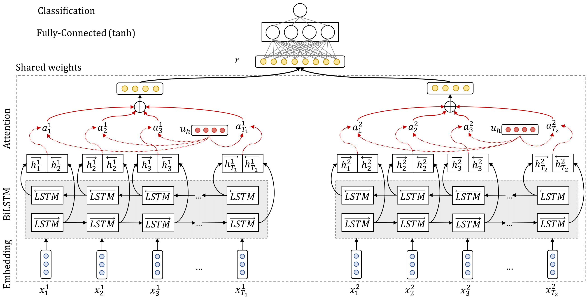

## Overview
This repository contains the source code for the models used for _DataStories_ team's submission
for [SemEval-2017 Task 6 “#HashtagWars: Learning a Sense of Humor”](http://alt.qcri.org/semeval2017/task6/).
The model is described in the paper ["SemEval-2017 Task 6: Siamese LSTM with Attention for Humorous Text Comparison"](http://nlp.arizona.edu/SemEval-2017/pdf/SemEval065.pdf).

Citation:
```
@InProceedings{baziotis-pelekis-doulkeridis:2017:SemEval1,
  author    = {Baziotis, Christos  and  Pelekis, Nikos  and  Doulkeridis, Christos},
  title     = {DataStories at SemEval-2017 Task 6: Siamese LSTM with Attention for Humorous Text Comparison},
  booktitle = {Proceedings of the 11th International Workshop on Semantic Evaluation (SemEval-2017)},
  month     = {August},
  year      = {2017},
  address   = {Vancouver, Canada},
  publisher = {Association for Computational Linguistics},
  pages     = {381--386}
}
```



*A higl-level overview of the model for SubTask A.*


**Notes**

* If what you are just interested in the source code for the model then just see 
[models/task6A_models.py](https://github.com/cbaziotis/datastories-semeval2017-task6/blob/master/models/task6A_models.py).

* The models were trained using Keras 1.2. In order for the project to work with Keras 2 some minor changes will have to be made.


## Prerequisites
#### 1 - Install Requirements
```
pip install -r /datastories-semeval2017-task6/requirements.txt
```

#### 2 - Download pre-trained Word Embeddings
The models were trained on top of word embeddings pre-trained on a big collection of Twitter messages.
We collected a big dataset of 330M English Twitter messages posted from 12/2012 to 07/2016. 
For training the word embeddings we used [GloVe](https://github.com/stanfordnlp/GloVe).
For preprocessing the tweets we used [ekphrasis](https://github.com/cbaziotis/ekphrasis), 
which is also one of the requirements of this project.

You can download one of the following word embeddings:
- [datastories.twitter.50d.txt](https://mega.nz/#!zsQXmZYI!M_y65hkHdY88iC3I8Yeo7N9IRBI4D9mrpz016fqiXwQ): 50 dimensional embeddings
- [datastories.twitter.100d.txt](https://mega.nz/#!OsYTjIrQ!gLp6YLa0A3ncXjaUffbgL2RtUI74bvSkUKpflAS0OyQ): 100 dimensional embeddings
- [datastories.twitter.200d.txt](https://mega.nz/#!W5BXBISB!Vu19nme_shT3RjVL4Pplu8PuyaRH5M5WaNwTYK4Rxes): 200 dimensional embeddings
- [datastories.twitter.300d.txt](https://mega.nz/#!u4hFAJpK!UeZ5ERYod-SwrekW-qsPSsl-GYwLFQkh06lPTR7K93I): 300 dimensional embeddings

Place the file(s) in `/embeddings` folder, for the program to find it.


## Execution


#### Word Embeddings
In order to specify which word embeddings file you want to use, 
you have to set the values of `WV_CORPUS` and `WV_WV_DIM` in `task6A.py` and `task6A_LOO.py` respectively.
The default values are:
```python
WV_CORPUS = "datastories.twitter"
WV_DIM = 300
```

The convention we use to identify each file is:
```
{corpus}.{dimensions}d.txt
```

This means that if you want to use another file, for instance GloVe Twitter word embeddings with 200 dimensions,
you have to place a file like `glove.200d.txt` inside `/embeddings` folder and set:
```python
WV_CORPUS = "glove"
WV_DIM = 200
```


#### Model Training
You will find the programs for training the Keras models, in `/models` folder.
```
models
│   task6A_models.py : contains the Keras models
│   task6A.py        : program for training the model for Task6A
│   task6A_LOO.py    : program for Leave-One-Out cross validation
```

**Semeval 2017 Task6A**: For training a model for Semeval 2017 Task6A, then you have to run `task6A.py`. 
Read the source code and configure the program using the corresponding flags.

If running with flag `PERSIST=True` then the checkpointing will be ON. 
This means that the model weights with the corresponding word indices will be saved to disk:
```
models/cp_model_task6_sub1.hdf5
models/cp_model_task6_sub1_word_indices.pickle
```
Usually after 1 or 2 epochs the network will start to overfit so you can just stop the execution.


**#HashtagWars evaluation**: 
In order to test our model using the evaluation method (Leave-One-Out cross validation) in 
Potash et al. "# HashtagWars: Learning a Sense of Humor." arXiv:[1612.03216](https://arxiv.org/abs/1612.03216),
you have to run `task6A_LOO.py`.
Read the source code and configure the program using the corresponding flags.

The program will save the results of each run and place them in `/models/results/`.
You can evaluate those results by running `/models/results/results_loo.py`.


#### Generate submissions
The `submissions/` folder contains a trained model with the corresponding word indices and the generated submission files.
If you want to generate new submissions for the SemEval test set, 
just train a model with `task6A.py` and move the files 
```
models/cp_model_task6_sub1.hdf5
models/cp_model_task6_sub1_word_indices.pickle
```
to the `submissions/` folder. 

You can generate new submissions and evaluate the performance of a model with `submissions/submit_task6_1.py`.